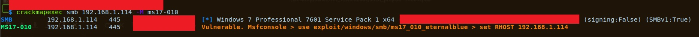

# cme-ms17-010-module
Fixed ms17-010 module for Crackmapexec.

Now shows whether Vulnerable or not target. Also support multiple hosts

Usage:
  1. Find out with `locate` Path to /cme/modules/* 
  2. Replace ms17-010.py in Path with this tested one script.
  3. `crackmapexec smb {ip}\{mask} -M ms17-010`
